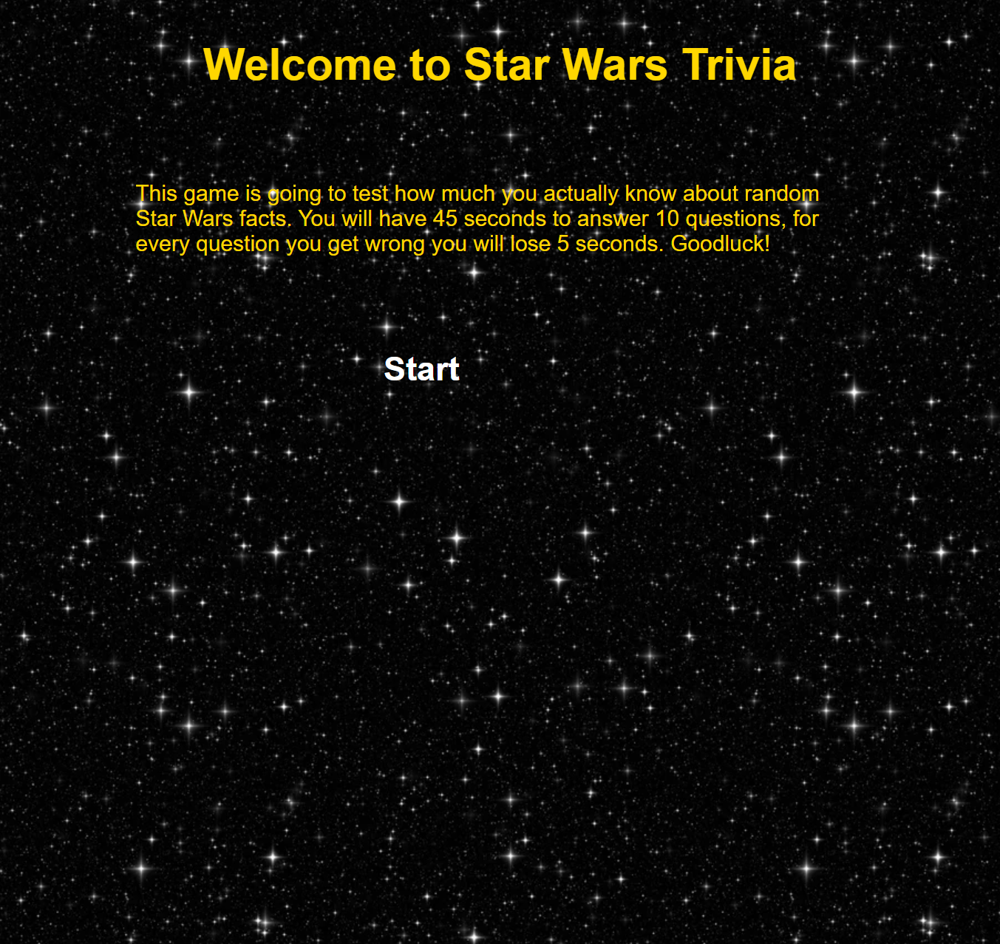
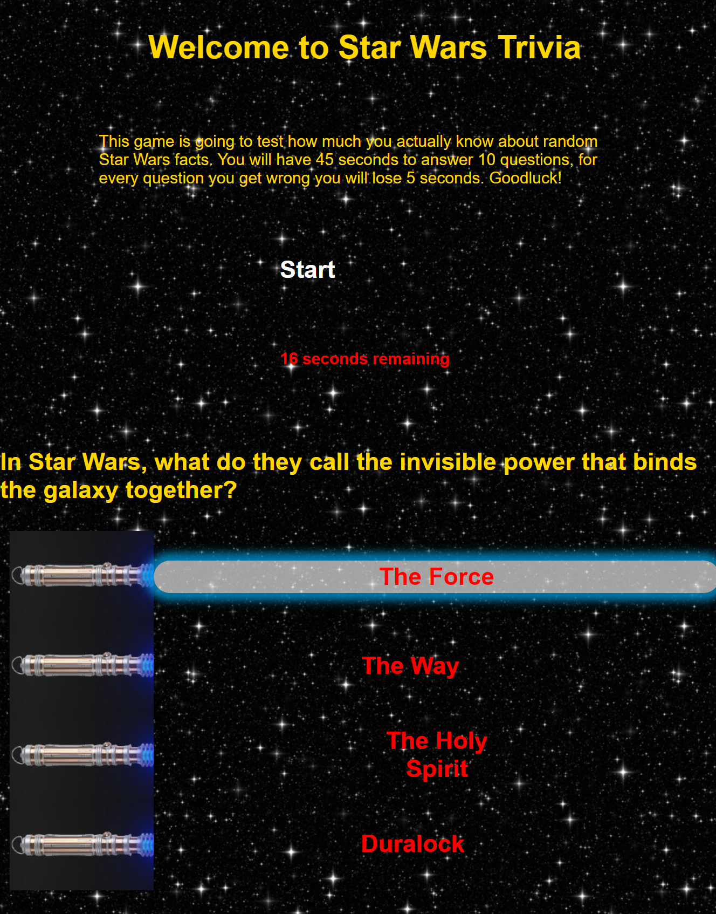

# STAR WARS Trivia Game

This game has been developed to exhibit proficiency in both CSS and Javascript, using interactive elements to create, append, and change variables and classes.

# Getting started

To start this game, simply click the start button.
You will then be prompted with questions in the form of light sabers openning when you hover over them.
Upon completion of the game you will be prompted to add your initials and submit them in a form.  These will be stored in local storage and displayed on the second play through.

# Acknowledgments

 Support from
 - Jeffery Littleton
 - Andrew Edwards
 - Eric Sayer